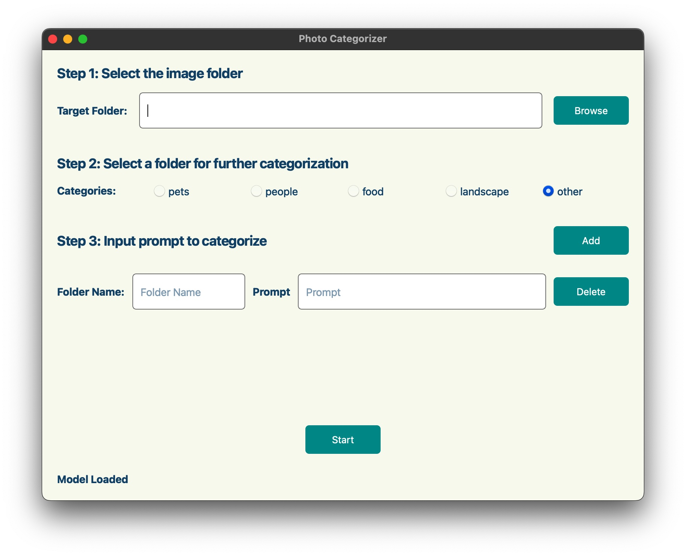

# 📂 Photo Categorizer App

Photo Categorizer is a desktop application that allows you to **automatically categorize images into different folders** based on prompts using the CLIP model. The application includes a **PyQt6 frontend GUI**, a **Flask backend**, and a **model service based on OpenAI CLIP**.

---

## 🏗️ Project Structure

```
photo-categorizer/
│
├── photo_categorizer/
│   ├── backend/            # Flask backend service
│   │   └── backend.py
│   ├── frontend/           # PyQt6 GUI frontend
│   │   ├── frontend.py
│   │   └── styles.qss      # Styling
│   ├── model/              # Model definitions and factory
│   │   ├── BaseModelEngine.py
│   │   ├── clip_engine.py
│   │   ├── model_factory.py
│   │   └── model_types.py
│   ├── config.py           # configuration
│   ├── logger.py           # Logging configuration
│   ├── main.py             # Application entry point
│   └── state.py            # State management
└── README.md
```

---

## 🚀 Features

- **Categorize images** using natural language prompts (via CLIP model).
- **Modern PyQt6 GUI** for selecting target folder and prompts.
- Real-time **progress bar** tracking categorization process.
- Backend status monitoring (model load, image load, per-folder process).
- Asynchronous **threading** for backend model/image processing without blocking UI.
- **Backend state polling** to sync frontend.
- Easy packaging for distribution (`PyInstaller` ready).

---

## 🔧 How It Works

### 1. **Frontend (PyQt6)**
- Provides a simple GUI where users can:
  - Select a **target folder** containing images.
  - Specify **output folders** and **text prompts** for categorization.
- Starts backend service automatically.
- Monitors backend status and updates UI accordingly.
- Initiates image loading and categorization when ready.
- Progress bar updates as each folder gets processed.
- Option to open the categorized folder when done.

> **Frontend file**: `photo_categorizer/frontend/frontend.py`

---

### 2. **Backend (Flask)**
- Handles communication between frontend and model.
- Supports API endpoints:
  - `/load-model`: Load the selected model in background.
  - `/model-status`: Check if model is loaded.
  - `/load-images`: Preload and process images from a target directory.
  - `/start-process`: Start image classification per output folder/prompt.
  - `/process-status`: Track the status of each folder being processed.

> **Backend file**: `photo_categorizer/backend/backend.py`

---

### 3. **Model (CLIP)**
- Loads CLIP model to run similarity searches on images.
- Processes images to prepare them for similarity comparison.
- Searches for image similarities to user-provided prompts.
- Supports efficient batch similarity search.

> **Model file**: `photo_categorizer/model/clip_engine.py`

---

## 🖥️ How to Run

### 1. **Install Requirements**


```bash
poetry install
```

### 2. **Run the Application**

```bash
python photo_categorizer/main.py
```

### 3. **Optional: Package the App**

Using PyInstaller:
- Windows

```bash
pyinstaller --windowed --onefile --name "PhotoCategorizer" ^
  --add-data "photo_categorizer\\frontend\\styles.qss;photo_categorizer/frontend" ^
  --add-data "photo_categorizer\\backend;photo_categorizer/backend" ^
  --add-data "photo_categorizer\\model;photo_categorizer/model" ^
  photo_categorizer\\main.py
```
- Mac

```bash
pyinstaller --windowed --onefile --name "PhotoCategorizer" \
  --add-data "photo_categorizer/frontend/styles.qss:photo_categorizer/frontend" \
  --add-data "photo_categorizer/backend:photo_categorizer/backend" \
  --add-data "photo_categorizer/model:photo_categorizer/model" \
  photo_categorizer/main.py

```


---

## ✅ Usage

1. **Select target folder** — choose the images to categorize.
2. **Add output folders and prompts** — specify how you want to categorize images.
3. **Start categorization** — watch the progress bar as each folder is processed.
4. **Review results** — categorized images will be moved into the corresponding output folders.

---


## 📷 Screenshots

### Main Interface



---

## 📦 Future Improvements

- [ ] Add image preview.
- [ ] Add drag-and-drop for target folder.
- [ ] Extend model choices (support BLIP, LLaVA, etc.).
- [ ] Threshold slider in UI.

---

## 👨‍💻 Authors

- KeeHLY
  - li.kai4@northeastern.edu
  - liu.muz@northeastern.edu
  - li.xueyun@northeastern.edu
  - cheng.yao1@northeastern.edu
  - liu.zile@northeastern.edu

---

## 📜 License

This project is licensed under the [MIT License](./LICENSE).

